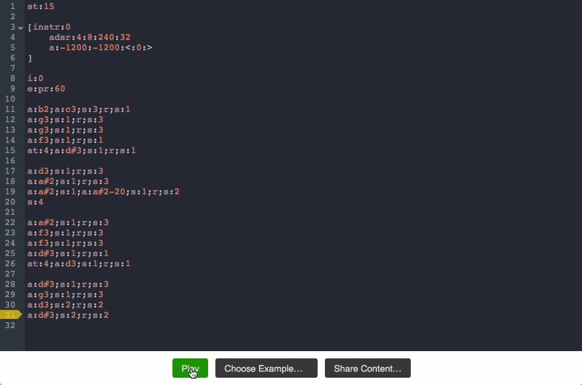

# bliplay WebAssembly Version

This is a version of [bliplay](https://github.com/detomon/bliplay) compiled for WebAssembly. It uses the browser's `AudioContext` API to output sound.

Check out the [syntax description](https://github.com/detomon/bliplay/blob/master/SYNTAX.md). Some example files are located in [examples](https://github.com/detomon/bliplay/tree/master/examples).

## Interactive Editor

The [interactive code editor](https://play.blipkit.audio) allows to write `.blip` and execute code. It dynamically compiles the code and outputs the sound. It should run in all major browsers.



## Shareble URLs

The editor supports shareable URLs, which contain a compressed version of the editor code in the URL fragment. [This page](https://play.blipkit.audio/links.html) contains some examples.

The format looks like this:

```
https://play.blipkit.audio/#s=<data>
```

Where `<data>` is a Base64 encoded and gzip compressed (deflated) string:

```
data = base64_encode(gzcompress("a:c4;s:4;...")).
```
